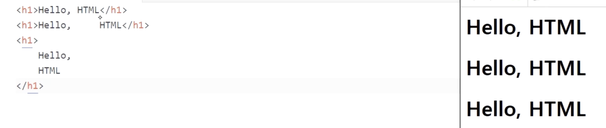

# html/css

# HTML 문법

- 기본적으로 HTML은 두 칸 이상의 공백을 모두 무시함

  

  - 왼쪽의 세 가지 요소는 모두 동일하게 나옴
  - 두 칸 이상의 공백, 여러 줄이 개행도 모두 무시하기 때문

- 주석

  - 화면에 노출되지 않고 메모용으로만
    ```html
    <!-- 주석은 이렇게! -->
    ```

- CSS 선택자

  - 전체 선택자 (편리하지만 성능엔 좋지 않음)

  ```css
  * {
    color: yellow;
  }
  ```

- CSS 선택자 조합

```css
/* 요소와 클래스의 조합 */
p.bar {
  ...;
}

/* 다중 클래스 */
.foo.bar {
  ...;
}

/* 아이디와 클래스의 조합 */
#foo.bar {
  ...;
}
```

- CSS 속성의 정의와 syntax 확인 방법
  - [w3schools](www.w3schools.com)
